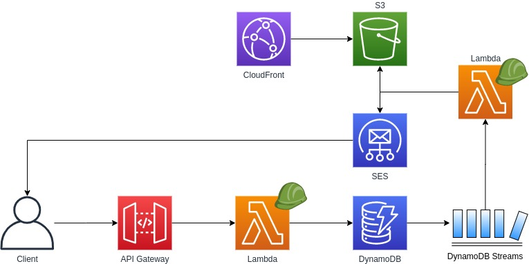

# Welcome to External API Call project!

This is a project that generate a **CloudFormation** template and deploy it using **AWS CDK** (AWS Cloud Development Kit)

Let's start to configure your environment!

## Architecture

## Prerequisites

To work with AWS CDK, you must have an AWS account and credentials and have installed Node.js (v10.3 or later) and the AWS CDK Toolkit.

If you already have Node.js, installl the AWS CDK Toolkit:

    npm install -g aws-cdk

Test the installation by issuing `cdk --version`.

You also need TypeScript itself. If you don't already have it, you can install it using `npm`.

    npm install -g typescript

Check if you have the AWS CLI installed and configured.

#### Tip

If you have the [AWS CLI](https://aws.amazon.com/cli/) installed, the simplest way to set up your workstation with your AWS credentials is to open a command prompt and type:

    aws configure

## First steps

To deploy the project, you must run the next commands.

- Open a terminal, navigate to the root project and run `npm install`. This command will install all project dependencies.

Now, we're going to install the lambdas dependencies because lambda functions must be uploaded with its package dependencies.

- Open a terminal, nagigate to `/lib/lambdas/create-request` folder and run `npm install`.
- Open another terminal and navigate to `/lib/lambdas/stream-processor` folder and run `npm install`.

## Configure Key Pair for CloudFront distribution

It's very important that you generate a Key Pair and save them into a safe place. You can follow the next steps to generate them:

1. Log in into AWS Console using root credentials.
2. In your user name, go to "My Security Credentials".
3. Expand "CloudFront key pairs".
4. Click on "Create New Key Pair".
5. Download the private and public key and place take note of Access Key ID showed in the Console.
6. SAVE THEM INTO A SAFE PLACE.

## Project configuration

You must customize the project variables. Check the file located at `lib/project.config.ts`.

**IMPORTANT!** Please customize CloudFront Distribution following the next steps:

1. Open in a Notepad or Writepad the .pem file that its name starts with pk.
2. Use the function "Replace all" to replace **\n** (enter symbol) with **\\n** (escaped enter symbol).
3. Copy text and paste it into the key **cloudFormation.privateKey**.

## Deploy resources to AWS

The deploy process is very streightforward. Just run the next command:

1.  Open a terminal and navigate to the project root.
2.  Because we have to deploy the code of our lambda, we have to configure AWS to receive it. Execute `cdk bootstrap aws://{account-number}/{region} [--profile profile-name]`. You can find the AccountID in **MyAccount** menú. This will create a bucket to upload all files.
3.  Execute `cdk deploy [--profile profile-name]`.
4.  You will have to confirm the resources that you're going to deploy, specially related to the security.
5.  If you go to AWS Console and open CloudFormation service, you'll find there the template.

## Troubleshotting

- The code doesn't work. If you run all mentioned steps, check the next common issue.
  - Run in the terminal the next command `cdk --version`.
  - Ensure that all dependant packages have the same version. You can check it into the `package.json` file at the root of the project.
  - For example, currently, the CDK's version I have is **1.47.0**. And if I check in the package.json the AWS dependendies (always starts with @aws-cdk/package-name) all of them have the same version ("@aws-cdk/aws-apigateway": **"1.47.0"**, "@aws-cdk/aws-iam": **"1.47.0"**).

## CDK Useful commands

- `npm run build` compile typescript to js
- `npm run watch` watch for changes and compile
- `npm run test` perform the jest unit tests
- `cdk deploy` deploy this stack to your default AWS account/region
- `cdk diff` compare deployed stack with current state
- `cdk synth` emits the synthesized CloudFormation template

## Improvements

- Move all API Keys and secrets to AWS Secret Manager.
- To reduce service cost (CloudFormation+S3), you can attach the file into the email.
- If you have a lot of request of the same email account, you can implement Dynamo DAX to improve the response.
